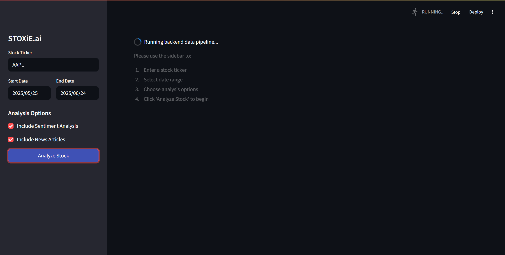
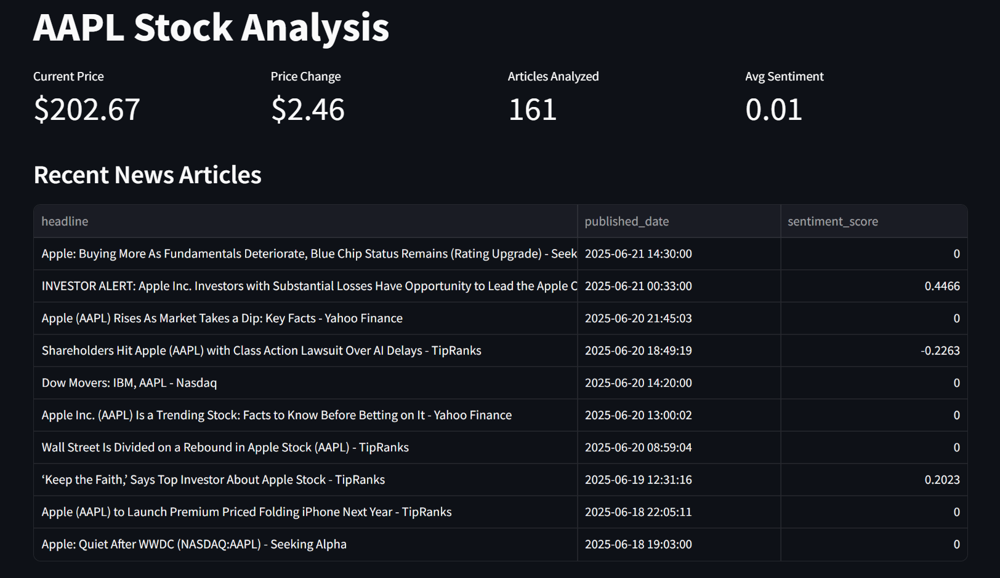
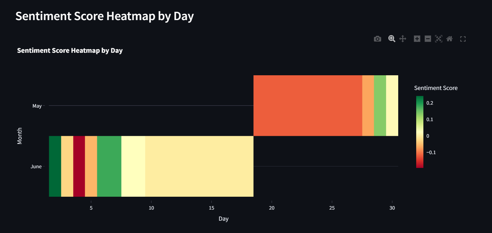
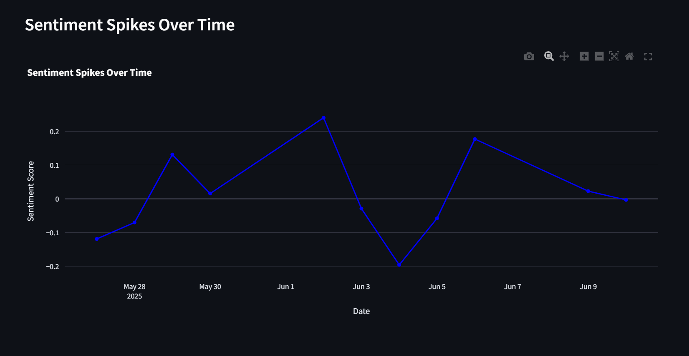
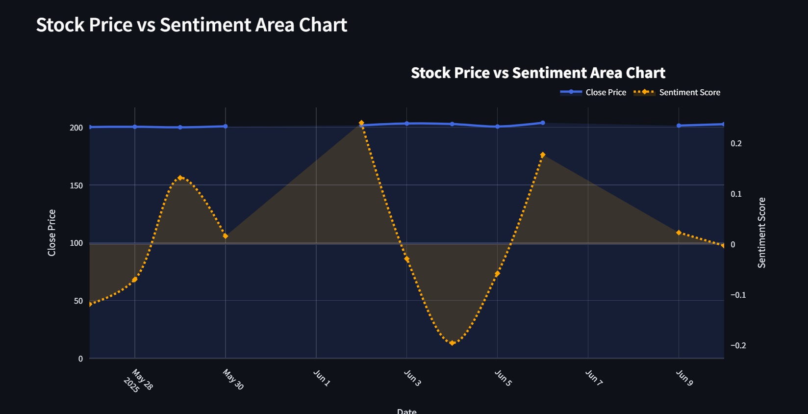
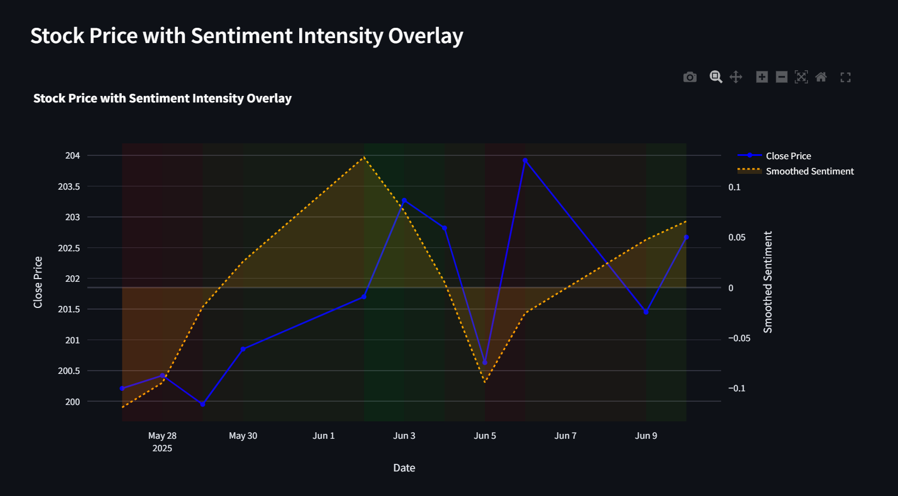
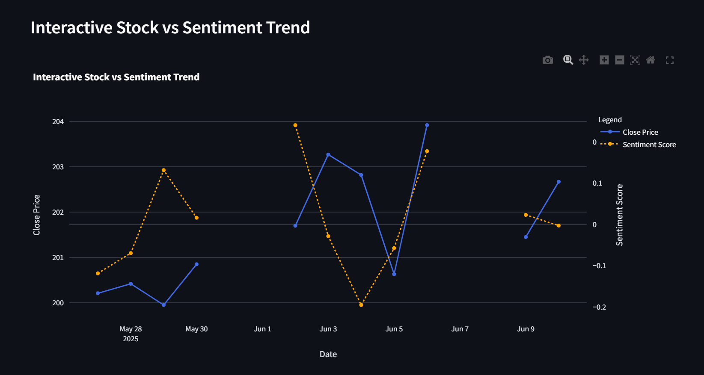

# STOXiE.ai: AI-Powered Stock Sentiment & Price Analysis

## Overview
STOXiE.ai is an end-to-end AI-powered web application for stock analysis, combining real-time price data, news sentiment analysis, and advanced visualizations. The project features a robust Python backend and a modern Streamlit frontend, enabling users to:
- Input a stock ticker and date range
- Fetch and analyze stock price and news article data
- Run sentiment analysis on news headlines
- Visualize trends, sentiment, and price predictions
- Receive AI-generated recommendations

---

## Features
- **Streamlit Frontend**: Clean, user-friendly UI for input, output, and interactive charts
- **Backend Pipeline**: Automated data fetching, sentiment analysis, and database updates
- **Database Integration**: Stores and merges price, sentiment, and article data
- **Visualizations**: Area charts, heatmaps, overlays, interactive trends, and spike detection
- **AI Recommendation Engine**: Actionable insights based on data and sentiment
- **Price Prediction**: Predicts and displays the stock price for 15 days after the selected end date using AI models.
- **Robust Error Handling**: Handles missing data, duplicate UI elements, and backend errors

---

## Project Structure
```
AI Project/
├── src/
│   ├── backend/
│   │   ├── main.py                # Backend pipeline entrypoint
│   │   ├── data_handeling.py      # Data fetching, pushing, and DB utilities
│   │   ├── data_processing.py     # Sentiment analysis, merging, pct_change
│   │   ├── data_analysis.py       # All charting and model functions
│   │   ├── general.py             # Logging, DB connection, upsert helpers
│   │   └── ...
│   ├── frontend/
│   │   ├── frontend.py            # Streamlit app (UI, charts, recommendations)
│   │   └── static/                # Custom CSS/JS
│   └── ...
├── logs/                          # Log files
├── README.md                      # This file
└── requirements.txt               # required libraries
```

---

## How It Works
1. **User Input**: Enter ticker, date range, and options in the Streamlit sidebar
2. **Backend Trigger**: On "Analyze Stock", the frontend runs `main.py` to fetch/process data
3. **Data Pipeline**:
    - Fetches stock prices and news articles
    - Runs sentiment analysis on headlines
    - Merges sentiment and price data, calculates `pct_change`
    - Updates the database
4. **Frontend Visualization**:
    - Loads processed data from the database
    - Displays summary metrics, charts, news, AI recommendations, and **predicted price for 15 days after the selected end date**

---

## Key Files & Functions
- `main.py`: Orchestrates the backend pipeline
- `data_handeling.py`: Data fetching/pushing, DB utilities
- `data_processing.py`: Sentiment analysis, merging, `pct_change` calculation
- `data_analysis.py`: Charting (area, heatmap, overlay, interactive, spikes), ML models
- `frontend.py`: Streamlit UI, triggers backend, displays all results, **predicts and displays future price**
- `recommendation.py`: AI recommendation logic
- `general.py`: Logging, DB connection, upsert helpers

---

## Setup & Usage
1. **Clone the repo**
2. **Install dependencies**:
   ```bash
   pip install -r requirements.txt
   ```
3. **Configure environment variables** (DB credentials, API keys) in a `.env` file
4. **Run the app**:
   ```bash
   streamlit run src/frontend/frontend.py
   ```
5. **Use the UI**: Enter a ticker, select dates, and click "Analyze Stock"

---

## Technologies Used
- Python 3.10+
- Streamlit
- Pandas, NumPy
- SQLAlchemy, SQLite/Postgres
- yfinance, GNews
- Plotly, Seaborn, Matplotlib
- Scikit-learn (ML models)
- crewai with ChatGPT API

---

## Example Screenshots

Below are example screenshots of the STOXiE.ai application, including the UI, charts, and AI recommendations:

---

### 1. Streamlit UI Sidebar & Loading State


*Modern Streamlit sidebar for input and loading state during backend processing.*

---

### 2. Main Dashboard & News Table


*Main dashboard showing current price, price change, articles analyzed, average sentiment, and recent news articles.*

---

### 3. Sentiment Score Heatmap by Day


*Heatmap visualizing daily sentiment scores for each day and month.*

---

### 4. Sentiment Spikes Over Time


*Line chart showing spikes in sentiment scores over time.*

---

### 5. Stock Price vs Sentiment Area Chart


*Dual-axis area chart showing stock price and sentiment score trends.*

---

### 6. Stock Price with Sentiment Intensity Overlay


*Overlay chart visualizing stock price with sentiment intensity background.*

---

### 7. Interactive stock vs sentiment trend



---

## Author & Contact
- **Author:** [Dhaani Jain]
- **GitHub:** [your-github-link]
- **LinkedIn:** [your-linkedin-link]

---

## Acknowledgements
- OpenAI, Streamlit, yfinance, GNews, Plotly, and all open-source contributors

---

*Feel free to fork, contribute, or reach out for collaboration!*
